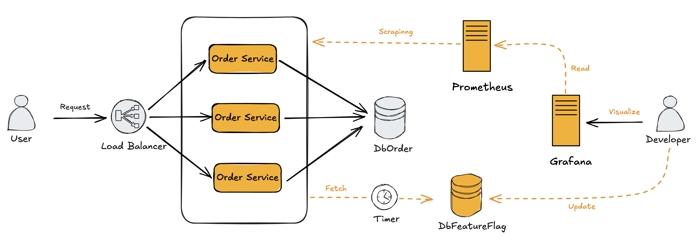

# Feature Flag
Essa aplicação é um exemplo prático do uso do conceito de Feature Flag para aplicações em larga escala.

### Solução
Aplicações distribuídas e de larga escala podem ter centenas ou até milhares de instâncias em execução simultânea. O controle da ativação e desativação de feature flags precisa ser realizado de forma rápida e segura para permitir a ativação de novas funcionalidades para testes, mas também possibilitar a desativação imediata em caso de problemas.

A solução proposta é simples e eficiente. Ela consiste em um banco de dados central que mantém o status de cada feature flag, o qual é consultado a cada minuto por cada instância da aplicação. Além disso, a aplicação envia métricas para o Prometheus, permitindo que os desenvolvedores acompanhem o status de cada feature flag em todas as instâncias. Isso viabiliza um monitoramento preciso e em tempo real das funcionalidades em produção.
### Arquitetura

### Executando
A aplicação está configurada para ser executada com Docker Compose. Para iniciá-la, entre no diretório raiz da aplicação e execute o seguinte comando:

`
docker-compose up --build
`

Após a inicialização dos serviços pelo Docker Compose, acesse o Grafana através da URL http://localhost:3000 em seu navegador. Utilize `admin` como usuário e senha para fazer o login.

### Arquivos