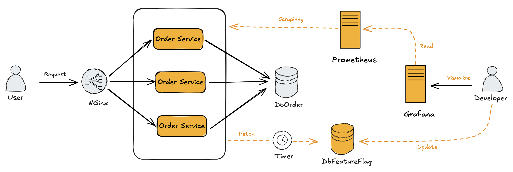

# Feature Flag
Essa aplicação é um exemplo prático do uso do conceito de Feature Flag para aplicações em larga escala.

### Solução
Aplicações distribuídas e de larga escala possuem centenas ou milhares de instâncias da aplicação em execução. O controle da ativação e desativação das features flags precisam ser feitas de forma rápida e segura, a fim de ativar as novas funcionalidades para testes, mas também para desativá-la rapidamente em caso de problema.

A abordagem é simples. A solução consiste de um banco de dados, que mantem o status das features flag e que são consultadas a cada 1 minuto por cada instância da aplicação. Por outro lado, a aplicação enviará métricas para o Prometheus, a fim que informar ao desenvolvedor o status da feature flag em cada instância. Permitindo addim, o perfeito monitoramento. 

### Arquitetura

### Componentes

### Arquivos